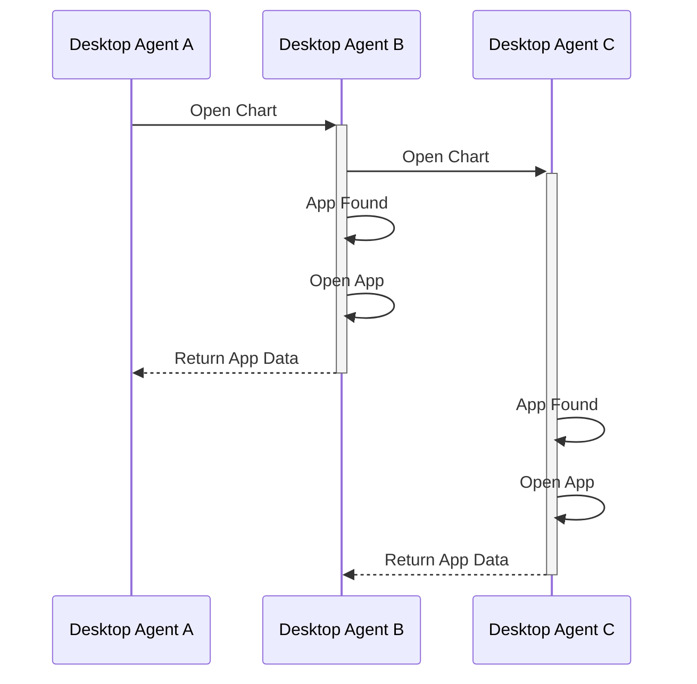
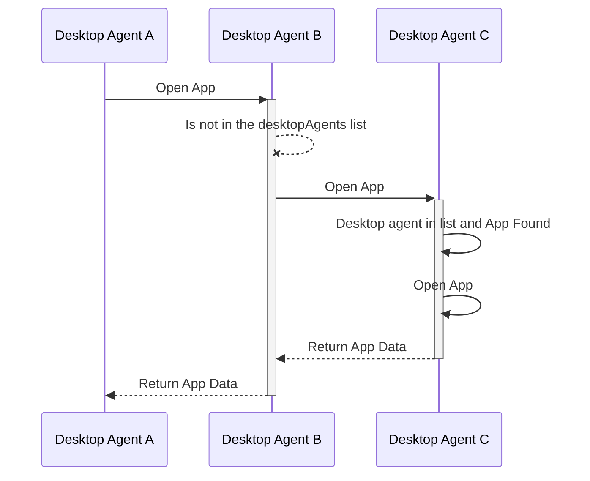
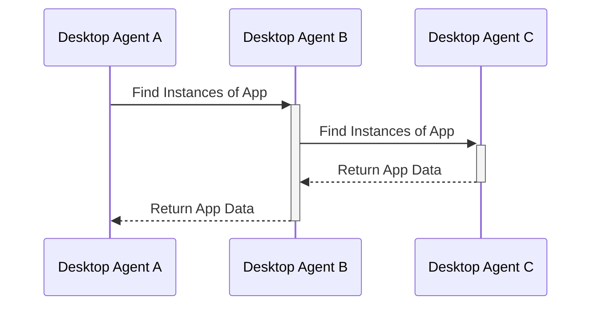

# Notes
Need to product some description of a protocol, to be used over a websocket, for exchanging messages about FDC3 calls between Desktop Agents.
## Overall protocol details
* Sender details to be added by websocket server to top level messages AND any embedded AppMetadata objects.
    * AppMetadata needs a new `agent `field
    * When a client connects to a server it should be assigned an identity of some sort, which can be used to augment messages with details of the agent
        * The server should do the assignments and could generate ids or accept them via config.
        * Clients don't need to know their own ids or even the ids of others, they just need to be able to pass around AppMetadata objects that contain them.
* Preserve message path as it passes through different servers?
* GUIDs required to uniquely identify messages
    * To be referenced in replies
* Desktop agents that are bridged will need to wait for responses from other desktop agents before responding to API calls…
    * for resilience, this may mean defining timeouts
    * Desktop Agents may need GUIDs and / OR metadata - names?


## Generic request and response formats

### Request:
```typescript
{
   /** Unique guid for this request */
   requestGuid: string,
   /** Timestamp at which request was generated */
   timestamp:  date,
   /** FDC3 function name message relates to, e.g. "findIntent" */
   type:  string,
   /** Request body, containing the arguments to the function called.*/
   payload: {
       //example fields for specific messages... wouldn't be specified in base type
       channel?: string,
       intent?: string,
       context?: Context,
       //fields for other possible arguments
   },
   /** AppMetadata source request received from */
   source?: {
       AppMetadata & {
           desktopAgent?: string // filled in by server on receipt of message
       }
   }
}
```

### Response:
Responses will be differentiated by the presence of a `responseGuid` field.
```typescript
{
    /** Value from request*/
    requestGuid: string,
    /** Unique guid for this response */
    responseGuid:  string,
    /** Timestamp at which request was generated */
    timestamp:  Date,
    /** FDC3 function name the original request related to, e.g. "findIntent" */
    type:  string, //same as request value
    /** Response body */
    payload: {
        //example fields for specific messages... wouldn't be specified in base type
        intent?:  string,
        appIntent?:  AppIntent,
        //fields for other possible response values
    },
    /** AppMetadata source request received from */
    source?: {
        AppMetadata & {
            desktopAgent?: string // filled in by server on receipt of message
        }
    }
    /** AppMetadata destination response sent from */
    destination?: {
        AppMetadata & {
            desktopAgent?: string // filled in by server on receipt of message
        }
    }
}
```
Clients should send these messages on to the 'server', which will add the `source.desktopAgent` metadata. Further, when processing responses, the agent acting as the 'server' should augment any `AppMetadata` objects in responses with the the same id applied to `source.desktopAgent`.


## Individual message exchanges
The sections below cover all scenerios for each of the Desktop Agent methods.
Each section assumes that we have 3 agents connected by bridge: agent-A, agent-B and agent-C. Agent-C provides a websocket server that agent-A and agent-B have connected to.

## Apps
### Open
```typescript
  open(app: TargetApp, context?: Context): Promise<AppMetadata>;
```
#### Request format:
A findIntent call is made on agent-A.
```javascript
// Open an app without context, using the app name
let instanceMetadata = await fdc3.open('myApp');

// Open an app without context, using an AppMetadata object to specify the target
let appMetadata = {name: 'myApp', appId: 'myApp-v1.0.1', version: '1.0.1'};
let instanceMetadata = await fdc3.open(appMetadata);

// Open an app without context, using an AppMetadata object to specify the target and Desktop Agent
let appMetadata = {name: 'myApp', appId: 'myApp-v1.0.1', version: '1.0.1', desktopAgents:["DesktopAgentB"]};
let instanceMetadata = await fdc3.open(appMetadata);

```
There are three scenerios where Desktop Agent A sends an Open command
1) The app is opened on all Desktop Agents instances
2) The app is not found on any Desktop Agent
3) The Desktop Agent(s) that the app should open on is specified by the end user ahead of time

**When the desktop agent is in a list**


It sends an outward message to the other desktop agents (sent from A -> C):
```JSON
{
   "requestGuid": "4dd60b3b-9835-4cab-870c-6b9b099ed7ae",
   "timestamp": "2020-03-...",
   "type": "open",
   "payload": {
       "appMetaData": {
           "name": "myApp",
           "appId": "myApp-v1.0.1",
           "version": "1.0.1",
           "desktopAgent":"DesktopAgentB"
           },
       "context": {/*contxtObj*/}
   }
}
```

which is repeated from C -> B as:
```JSON
{
    "requestGuid": "4dd60b3b-9835-4cab-870c-6b9b099ed7ae",
    "timestamp": 2020-03-...,
    "type": "open",
    "payload": {
       "appMetaData": {
           "name": "myApp",
           "appId": "myApp-v1.0.1",
           "version": "1.0.1",
           "desktopAgent":"DesktopAgentB"
           },
       "context": {/*contxtObj*/}
    },
    "sourceAgent": "agent-A"
}
```

### findInstances
```typescript
  findInstances(app: TargetApp): Promise<Array<AppMetadata>>;
```



## Context
### For broadcasts on channels
Only needs a single message (no response)
An app on agent-A does:
```javascript
fdc3.broadcast(contextObj);
```
or
```javascript
(await fdc3.getOrCreateChannel("myChannel")).broadcast(contextObj)
```

It encodes this as a message which it sends to the websocket server (agent-C)

Message flow: agent-A -> agent-C

```JSON
{
    "requestGuid": "some-guid-string-here",
    "timestamp": "2020-03-...",
    "type": "broadcast",
    "payload": {
        "channel": "myChannel",
        "context": { /*contxtObj*/ }
    },
    "source": {
        "name": "",
        "appId": "",
        "version": "",
        // ... other metadata fields
    }
}
```

which it repeats on to Agent-B with the `source.desktopAgent` metadata added.

Message flow: agent-C -> agent-B

```JSON
{
    "requestGuid": "some-guid-string-here",
    "timestamp": "2020-03-...",
    "type": "broadcast",
    "payload": {
        "channel": "myChannel",
        "context": { /*contxtObj*/}
    },
    "source": {
        "desktopAgent": "agent-A",
        "name": "",
        "appId": "",
        "version": "",
        // ... other metadata fields
    }
}
```

No message exchange, when adding context listeners or channel add context listener. Upon receving a broadcast it just forwards it to all listeners.

## Intents
### findIntent
```typescript
findIntent(intent: string, context?: Context): Promise<AppIntent>;
```

#### Request format:

A findIntent call is made on agent-A.
```javascript
let appIntent = await fdc3.findIntent();
```

Sends an outward message to the desktop agent(s) acting as server(s).

```JSON
// agent-A -> agent-C
{
   "requestGuid": "requestGuid",
   "timestamp": "2020-03-...",
   "type": "findIntent",
   "payload": {
       "intent": "StartChat",
       "context": {/*contxtObj*/}
   },
   "source": {
        "name": "",
        "appId": "",
        "version": "",
        // ... other metadata fields
    }
}
```

The server (agent-C) fills in the `source.desktopAgent` field and forwards the request to the other desktop agents.

```JSON
// agent-C -> agent-B
{
    "requestGuid": "requestGuid",
    "timestamp": "2020-03-...",
    "type": "findIntent",
    "payload": {
        "intent": "StartChat",
        "context": {/*contxtObj*/},
    },
    "source": {
        "desktoAgent": "agent-A",
        "name": "",
        "appId": "",
        "version": "",
        // ... other metadata fields
    }
}
```
Note that the `source.desktopAgent` field has been populated with the id of the agent that raised the requests, enabling the routing of responses.

#### Response format

Normal response from agent-A, where the request was raised (a websocket client)
```JSON
{
    "intent": { "name": "StartChat", "displayName": "Chat" },
    "apps": [
        { "name": "myChat" }
    ]
}
```

Desktop agent B (a websocket client) woud produce response:
```JSON
{
    "intent": { "name": "StartChat", "displayName": "Chat" },
    "apps": [
        { "name": "Skype" },
        { "name": "Symphony" },
        { "name": "Symphony", "instanceId": "93d2fe3e-a66c-41e1-b80b-246b87120859" },
        { "name": "Slack" }
    ]
}
```

which is sent back over the bridge as a response to the request message as:

```JSON
// agent-B -> agent-C
{
    "requestGuid": "requestGuid",
    "responseGuid":  "requestAgentBGuid",
    "timestamp":  "2020-03-...",
    "type":  "findIntentResponse",
    "payload": {
        "intent":  "StartChat",
        "appIntent":  {
            "intent":  { "name": "StartChat", "displayName": "Chat" },
            "apps": [
                { "name": "Skype"},
                { "name": "Symphony" },
                { "name": "Symphony", "instanceId": "93d2fe3e-a66c-41e1-b80b-246b87120859" },
                { "name": "Slack" }
            ]
        }
    },
    "destination": {
        "desktopAgent": "agent-A",
        "name": "",
        "appId": "",
        "version": "",
        // ... other metadata fields
    }
}
```

Which gets repeated by the websocket server (agent-C) in augmented form as:

```JSON
{
    "requestGuid": "requestGuid",
    "responseGuid":  "requestAgentB_Guid",
    "timestamp":  "2020-03-...",
    "type":  "findIntentResponse",
    "payload": {
        "intent":  "StartChat",
        "appIntent":  {
            "intent":  { "name": "StartChat", "displayName": "Chat" },
            "apps": [
                { "name": "Skype", "desktopAgent": "agent-B"},
                { "name": "Symphony", "desktopAgent": "agent-B" },
                { "name": "Symphony", "instanceId": "93d2fe3e-a66c-41e1-b80b-246b87120859", "desktopAgent": "agent-B" },
                { "name": "Slack", "desktopAgent": "agent-B" }
            ]
        }
    },
    "destination": {
        "desktopAgent": "agent-A",
        "name": "",
        "appId": "",
        "version": "",
        // ... other metadata fields
    },
    "source": {
        "desktoAgent": "agent-B",
    }
}
```

Desktop agent C (the websocket server) also sends its own response:
```JSON
{
    "intent":  { "name": "StartChat", "displayName": "Chat" },
    "apps": [
       { "name": "WebIce"}
    ]
}
```

which it encodes as a message:
```JSON
{
    "requestGuid": "requestGuid",
    "responseGuid":  "requestAgentC_Guid",
    "timestamp":  "2020-03-...",
    "type":  "findIntentResponse",
    "payload": {
        "intent":  "StartChat",
        "appIntent":  {
            "intent":  { "name": "StartChat", "displayName": "Chat" },
            "apps": [
            { "name": "WebIce", "desktopAgent": "agent-C"}
            ]
        }
    },
     "destination": {
        "desktopAgent": "agent-A",
        "name": "",
        "appId": "",
        "version": "",
        // ... other metadata fields
    },
    "source": {
        "desktoAgent": "agent-C",
    }
}
```
Then on agent-A the originating app finally gets back the following response from agent-C:

```JSON
// agent-C -> agent-A
{
    "intent":  { "name": "StartChat", "displayName": "Chat" },
    "apps": [
        { "name": "myChat" }, // local to this agent
        { "name": "Skype", "desktopAgent": "agent-B" }, //agent-B responses
        { "name": "Symphony", "desktopAgent": "agent-B" },
        { "name": "Symphony", "instanceId": "93d2fe3e-a66c-41e1-b80b-246b87120859", "desktopAgent": "agent-B" },
        { "name": "Slack", "desktopAgent": "agent-B" },
        { "name": "WebIce", "desktopAgent": "agent-C"} //agent C response
    ]
}
```

### raiseIntent

```typescript
raiseIntent(intent: string, context: Context, app?: TargetApp): Promise<IntentResolution>;
```
For Desktop Agent bridging, a `raiseIntent` call MUST always pass a `app:TargetApp` argument. If one is not passed a `findIntent` will be sent instead. See details below.

#### Request format
A raiseIntent call, __without__ `app:TargetApp` argument is made on agent-A.

```typescript
raiseIntent(intent: string, context: Context): Promise<IntentResolution>;
```

agent-A sends an outward `findIntent` message to the desktop agent(s) acting as server(s):

```JSON
// agent-A -> agent-C
{
   "requestGuid": "requestGuid",
   "timestamp": "2020-03-...",
   "type": "findIntent",
   "payload": {
       "intent": "StartChat",
       "context": {/*contxtObj*/}
   },
   "source": {
        "name": "",
        "appId": "",
        "version": "",
        // ... other metadata fields
    }
}
```

This will trigger the same flow of `findIntent`. Upon receiveing a `findIntentResponse`, the resolver is shown.

User selects an option which will trigger a `raiseIntent` call with a `app:TargetApp` argument.

---

A `raiseIntent` call is made on agent-A which targets an `AChatApp` in agent-B.

```typescript
raiseIntent(intent: string, context: Context, app: TargetApp): Promise<IntentResolution>;
```

```JSON
// agent-A -> agent-C
{
   "requestGuid": "requestGuid",
   "timestamp": "2020-03-...",
   "type": "raiseIntent",
   "payload": {
       "intent": "StartChat",
       "context": {/*contxtObj*/},
       "app": {
           "name": "AChatApp",
           "desktopAgent": "agent-B"
       }
   },
   "source": {
        "name": "",
        "appId": "",
        // ... other metadata fields
   },
   "destination": { // duplicates the app argument
        "app": {
           "name": "AChatApp",
           "desktopAgent": "agent-B"
       }
   }
}
```

The agent-C (server) fills in the `source.desktopAgent` field and forwards the request to the target desktop agent.

```JSON
// agent-C -> agent-B
{
    "requestGuid": "requestGuid",
    "timestamp": "2020-03-...",
    "type": "raiseIntent",
    "payload": {
        "intent": "StartChat",
        "context": {/*contxtObj*/},
    },
    "source": {
        "name": "someOtherApp",
        "appId": "",
        "version": "",
        "desktopAgent": "agent-A" // <---- filled by server (C)
        // ... other metadata fields
   },
   "destination": {
        "app": {
           "name": "AChatApp",
           "desktopAgent": "agent-B"
       }
   }
}
```


#### Response format
Normal response from agent-B (to-C), where the request was targeted to by agent-A. It sends this `intentResolution` as soon as it delivers the `raiseIntent` to the target app.

```JSON
// agent-B -> agent-C
{
    "requestGuid": "requestGuid",
    "responseGuid": "responseGuid",
    "timestamp": "2020-03-...",
    "type": "intentResolution",
    "payload": {
        "intent": "StartChat",
        "source": {
            "name": "AChatApp",
            "appId": "",
            "version": "",
            // ... other metadata fields
        },
        "version": "...",
    },
    "error?:": "ResolveError Enum",
    "source": {
        "name": "AChatApp",
        "appId": "",
        "version": "",
        // ... other metadata fields
    },
    "destination": { // duplicates the app argument
        "app": {
           "name": "someOtherApp",
           "appId": "",
            "version": "",
            "desktopAgent": "agent-A"
            // ... other metadata fields
       }
   }
}
```

agent-C (server) will fill in the `source.DesktopAgent` and relay the message on to agent-A.

```JSON
// agent-C -> agent-A
{
    "requestGuid": "requestGuid",
    "responseGuid": "intentResolutionResponseGuid",
    "timestamp": "2020-03-...",
    "type": "intentResolution",
    "payload": {
        "intent": "StartChat",
        "source": {
            "name": "AChatApp",
            "appId": "",
            "version": "",
            "desktopAgent": "agent-B" // filled by server
            // ... other metadata fields
        },
        "version": "...",
    },
    "source": {
        "name": "AChatApp",
        "appId": "",
        "version": "",
        "desktopAgent": "agent-B" // filled by server
        // ... other metadata fields
    },
    "destination": { // duplicates the app argument
        "app": {
           "name": "someOtherApp",
           "appId": "",
            "version": "",
            "desktopAgent": "agent-A"
            // ... other metadata fields
       }
   }
}
```

When `AChatApp` produces a response, or the intent handler finishes running, it should send a further `intentResult` message to send that response onto the intent raiser (or throw an error if one occurred)

```JSON
// agent-B -> agent-C -> agent-A
{
    "requestGuid": "requestGuid",
    "responseGuid": "intentResultResponseGuid",
    "timestamp": "2020-03-...",
    "type": "intentResult",
    "payload?:": {
        "channel": {
            "id": "channel 1",
            "type": "system"
        },
        "context": {/*contextObj*/} // in alternative to channel
    },
    "error?:": "ResultError Enum",
    "source": {
        "name": "AChatApp",
        "appId": "",
        "version": "",
        "desktopAgent": "agent-B" // filled by server
        // ... other metadata fields
    },
    "destination": { // duplicates the app argument
        "app": {
           "name": "someOtherApp",
           "appId": "",
            "version": "",
            "desktopAgent": "agent-A"
            // ... other metadata fields
       }
   }
}
```

If intent result is private channel:

```JSON
// agent-B -> agent-C -> agent-A
{
    "requestGuid": "requestGuid",
    "responseGuid": "intentResultResponseGuid",
    "timestamp": "2020-03-...",
    "type": "intentResult",
    "payload?:": {
        "channel": {
            "id": "channel a",
            "type": "private"
        },
        "context": {/*contextObj*/} // in alternative to channel
    },
    "error?:": "ResultError Enum",
    "source": {
        "name": "AChatApp",
        "appId": "",
        "version": "",
        "desktopAgent": "agent-B" // filled by server
        // ... other metadata fields
    },
    "destination": { // duplicates the app argument
        "app": {
           "name": "someOtherApp",
           "appId": "",
            "version": "",
            "desktopAgent": "agent-A"
            // ... other metadata fields
       }
   }
}
```
---
`onSubscribe` to the private channel sent to server:

```JSON
// agent-A -> agent-C
{
    "requestGuid": "requestGuid",
    "timestamp": "2020-03-...",
    "type": "privateChannelSubscribe",
    "payload": {},
    "source": {
        "name": "AChatApp",
        "appId": "",
        "version": "",
        // ... other metadata fields
    },
    "destination": { // duplicates the app argument
        "app": {
           "name": "someOtherApp",
           "appId": "",
            "version": "",
            "desktopAgent": "agent-B"
            // ... other metadata fields
       }
   }
}
```

Server (agent-C) will add in the source agent (agent-A) and forward the message to destination (agent-B)

```JSON
// agent-A -> agent-C
{
    "requestGuid": "requestGuid",
    "timestamp": "2020-03-...",
    "type": "privateChannelSubscribe",
    "payload": {},
    "source": {
        "name": "AChatApp",
        "appId": "",
        "version": "",
        "desktopAgent": "agent-A"
        // ... other metadata fields
    },
    "destination": { // duplicates the app argument
        "app": {
           "name": "someOtherApp",
           "appId": "",
            "version": "",
            "desktopAgent": "agent-B"
            // ... other metadata fields
       }
   }
}
```
---
`onUnsubscribe` to the private channel sent to server

```JSON
// agent-A -> agent-C
{
    "requestGuid": "requestGuid",
    "timestamp": "2020-03-...",
    "type": "privateChannelUnsubscribe",
    "payload": {},
    "source": {
        "name": "AChatApp",
        "appId": "",
        "version": "",
        // ... other metadata fields
    },
    "destination": { // duplicates the app argument
        "app": {
           "name": "someOtherApp",
           "appId": "",
            "version": "",
            "desktopAgent": "agent-B"
            // ... other metadata fields
       }
   }
}
```

Server (agent-C) will add in the source agent (agent-A) and forward the message to destination (agent-B)

```JSON
// agent-C -> agent-B
{
    "requestGuid": "requestGuid",
    "timestamp": "2020-03-...",
    "type": "privateChannelUnsubscribe",
    "payload": {},
    "source": {
        "name": "AChatApp",
        "appId": "",
        "version": "",
        "desktopAgent": "agent-A",
        // ... other metadata fields
    },
    "destination": { // duplicates the app argument
        "app": {
           "name": "someOtherApp",
           "appId": "",
            "version": "",
            "desktopAgent": "agent-B"
            // ... other metadata fields
       }
   }
}
```
---
`onDisconnect` to the private channel sent to server

```JSON
// agent-A -> agent-C
{
    "requestGuid": "requestGuid",
    "timestamp": "2020-03-...",
    "type": "privateChannelDisconnect",
    "payload": {},
    "source": {
        "name": "AChatApp",
        "appId": "",
        "version": "",
        // ... other metadata fields
    },
    "destination": { // duplicates the app argument
        "app": {
           "name": "someOtherApp",
           "appId": "",
            "version": "",
            "desktopAgent": "agent-B"
            // ... other metadata fields
       }
   }
}
```

Server (agent-C) will add in the source agent (agent-A) and forward the message to destination (agent-B)

```JSON
// agent-C -> agent-B
{
    "type": "privateChannelDisconnect",
    "payload": {},
    "source": {
        "name": "AChatApp",
        "appId": "",
        "version": "",
        "desktopAgent": "agent-A"
        // ... other metadata fields
    },
    "destination": { // duplicates the app argument
        "app": {
           "name": "someOtherApp",
           "appId": "",
            "version": "",
            "desktopAgent": "agent-B"
            // ... other metadata fields
       }
   }
}
```
---

## Channels

